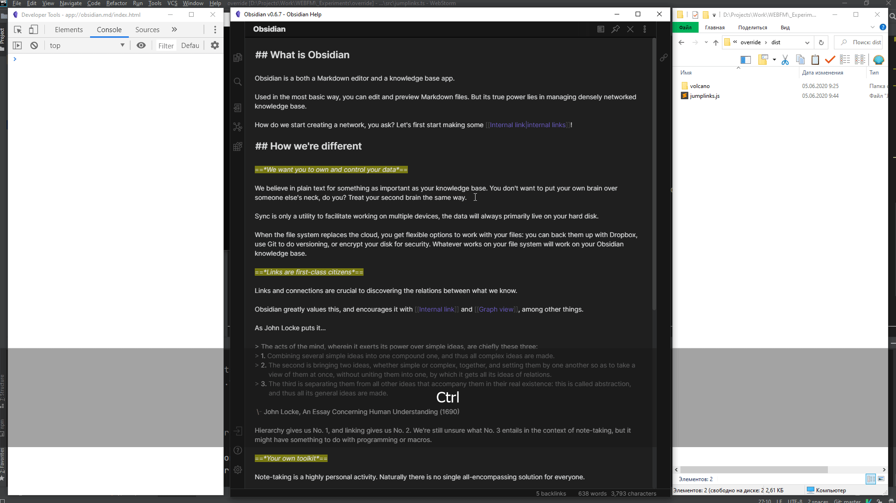

# Plugins for Obsidian

That's UNOFFICIAL way to improve your Obsidian experience. 

## Plugin List

- Jump to links (using `Ctrl+;` hotkey)
- Toggle TODO (using `Ctrl+Enter` hotkey). No version for volcano.
- Insert current date (using `Alt+D` hotkey). No version for volcano.

## How to install plugins

There is no official way to install plugins just yet. Meanwhile we have some options.

- Run code in Obsidian's console. Changes are not permanent and will be removed when you close Obsidian window or press `Ctrl+R`. Use files in the root of `dist` folder.
- Use UNOFFICIAL [plugin injector](https://github.com/kognise/volcano). If you need plugin for this, use files in `dist/volcano` folder.

## What is Obsidian?

A powerful note-taking tool which works with your local `.md` files. You can know more [here](https://obsidian.md/).

## Known issues

- Jump links works not correct with many links (there just not enough letters :) )

